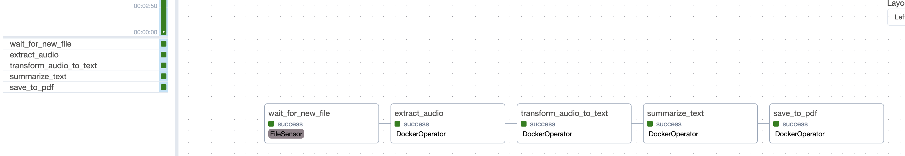
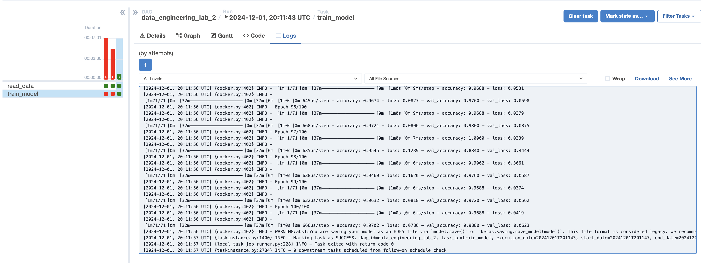

# Инференс

# Обучение

# Описание

Для каждого docker operator был использован самописный образ,
подтягивающий необходимые зависимости

При работе с модельями https://huggingface.co/openai/whisper-small 
https://huggingface.co/slauw87/bart_summarisation было использовано API huggingface
с соответствующими запросами

Для второго дага использовался тестовый датасет для бинарной классификации с простейшей моделью нс