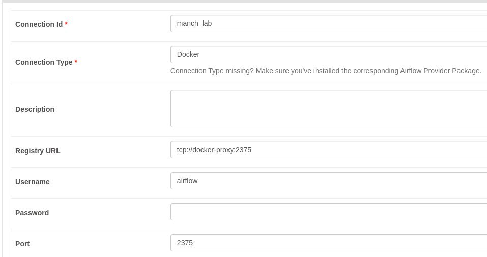
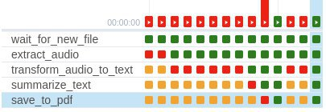
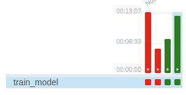

# Построение пайплайна для инференса и для обучения НС
### Работу выполнила Вахлаева Марина 6231-010402D
## Пайплайн для инференса данных

В рамках данной лабораторной работы необходимо построить два пайплайна:

* Пайплайн, который позволяет получить предсказания для исходных данных с помощью некоторой модели.
* Пайплайн, который позволяет обучить или дообучить целевую модель.

Для построения таких пайплайнов использовался Apache Airflow

#### Перечень сервисов с их адресами

* pgAdmin: <http://localhost:18081/>  (`pgadmin4@pgadmin.org`@`admin`)
* Kibana: <http://localhost:15601/>
* Apache Airflow: <http://localhost:8080/> (`airflow`@`airflow`)
* Apache Nifi: <http://localhost:18080/>
* MLflow: <http://localhost:5001>
* Minio: <http://localhost:9000> (`minio`@`minio123`)

## Задание 
### Пайплайн для инференса данных
В рамках данного задания предлагается построить пайплайн, который реализует систему "Автоматического распознавания речи" для видеофайлов.

Построенный пайплайн будет выполнять следующие действия поочередно:

1. Производить мониторинг целевой папки на предмет появления новых видеофайлов.
2. Извлекать аудиодорожку из исходного видеофайла.
3. Преобразовывать аудиодорожку в текст с помощью нейросетевой модели.
4. Формировать конспект на основе полученного текста.
5. Формировать выходной .pdf файл с конспектом.

### Пайплайн для обучения модели
В рамках данного задания предлагается построить пайплайн, который реализует систему автоматического обучения/дообучения нейросетевой модели.

Предлагается самостоятельно выбрать набор данных и модель для обучения. Например, можно реализовать пайплайн для обучения модели, которую вы планируете использовать в вашей НИР или ВКРМ. Это также позволит вам добавить отдельный пункт в ваш отчет.

Итак, пайплайн будет выполнять следующие действия:

1. Читать набор файлов из определенного источника (файловой системы, сетевого интерфейса и т.д.).
2. Формировать пакет данных для обучения модели.
3. Обучать модель.
4. Сохранять данные результатов обученя (логи, значения функции ошибки) в текстовый файл
Для успешного выполнения задания необходимо продемонстрировать успешность обучения модели и приложить файл .ipynb, в котором продемонстрирован процесс инференса данной модели.

## Выполнение
### Пайплайн для инференса данных
Данный пайплайн последовательно выполняет следующие действия: мониторит целевую папку на появление новых видеофайлов, извлекает аудиодорожку из видеофайла, преобразует ее в текст, формиурет конспект и сохраняет как .pdf.

#### 1. Мониторинг целевой папки на предмет появления новых видеофайлов
Мониторинг целевой папки осуществляется с помощью оператора FileSensor, его настройка производилась в Airflow.



``` Python
wait_for_new_file = FileSensor(
    task_id='wait_for_new_file',
    poke_interval=10,  # Interval to check for new files (in seconds)
    filepath='/opt/airflow/data/manch',  # Target folder to monitor
    fs_conn_id='manch_lab', # Check FAQ for info
    dag=dag,
)
```

#### 2.Извлечение аудиодорожки
Использовался образ `jrottenberg/ffmpeg` с `https://huggingface.co/`

Аудио сохранялось в формате .wav.

``` Python
extract_audio = DockerOperator(
    task_id='extract_audio',
    image='jrottenberg/ffmpeg',
    command='-i /data/manch/final.mp4 -vn /data/aud/audio.wav',
    mounts=[Mount(source='/data/manch', target='/data/manch', type='bind'), 
            Mount(source='/data/aud', target='/data/aud', type='bind')],
    docker_url="tcp://docker-proxy:2375",
    dag=dag,
)
```

#### 3.Преобразование аудиодорожки в текст

Для реализации данной задачи использовался `whisper-small`. 

``` Python
transform_audio_to_text = DockerOperator(
    task_id='transform_audio_to_text',
    image='vmokook23/audio_text',
    command='--audio_file /data/aud/audio.wav --output_path /data/text/output.txt --width 80',
    mounts=[Mount(source='/data/aud', target='/data/aud', type='bind'), 
            Mount(source='/data/text', target='/data/text', type='bind')],
    docker_url="tcp://docker-proxy:2375",
    dag=dag,
)
```

#### 4.Формирование конспекта
Для реализации данной задачи использовалась модель `facebook/bart-large-cnn`. 

``` Python
summarize_text = DockerOperator(
    task_id='summarize_text',
    image='vmokook23/text_conspect',
    command='--input_file /data/text/output.txt --output_file /data/summary/summary.txt',
    mounts=[Mount(source='/data/text', target='/data/text', type='bind'), 
            Mount(source='/data/summary', target='/data/summary', type='bind')],
    docker_url="tcp://docker-proxy:2375",
    dag=dag,
)
```

#### 5.Сохранение в pdf 
Для реализации данной задачи использовался pandoc

``` Python
save_to_pdf = DockerOperator(
    task_id='save_to_pdf',
    image='vmokook23/save_pdf',
    command='--input /data/summary/summary.txt --output /data/pdf/pdfka.pdf',
    mounts=[Mount(source='/data/summary', target='/data/summary', type='bind'),
            Mount(source='/data/pdf', target='/data/pdf', type='bind')],
    docker_url="tcp://docker-proxy:2375",
    dag=dag)
```

 

### Пайплайн для обучения модели

Данный пайплайн реализован в сыром варианте. Здесь происходит обучение простенькой нейронной сети для классификации цифр из датасета MNIST.

Считывание файлов происходит непосредственно с из датсета MNIST, поэтому таски 1 и 2 отсуствуют.

#### Обучение модели

``` Python
train_model = DockerOperator(
    task_id='train_model',
    image='vmokook23/trains_model',
    command='--log_file /data/log/training_logs.txt',
    mounts=[Mount(source='/data/log', target='/data/log', type='bind')],
    docker_url="tcp://docker-proxy:2375",
    dag=dag,
)
``` 
Данные обучения сохраняются в текстовый файл `training_logs.txt`.

 

