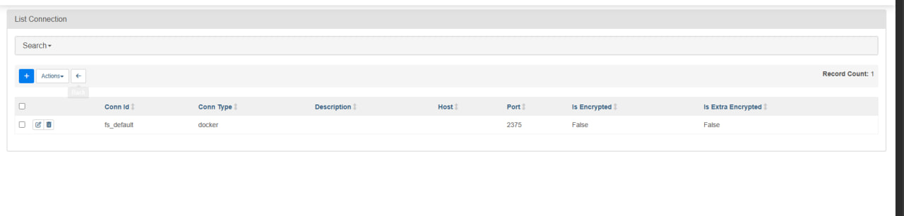
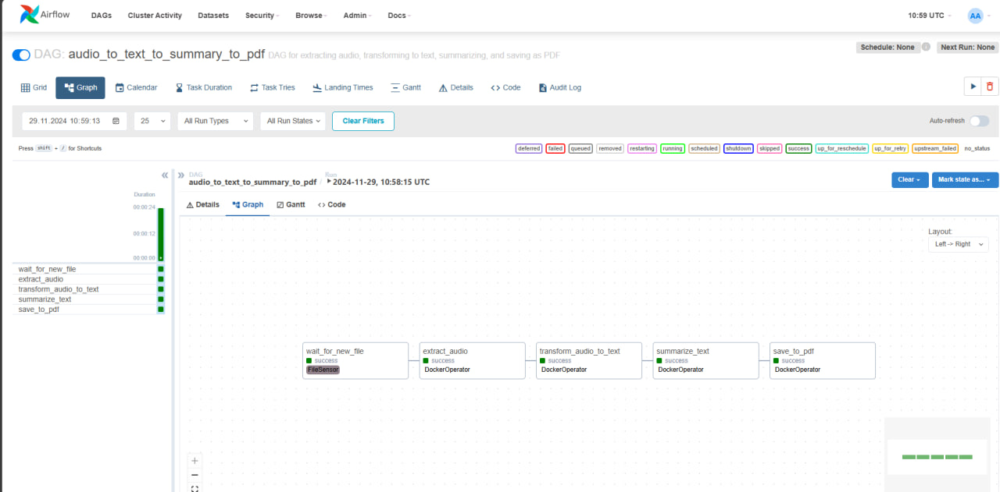
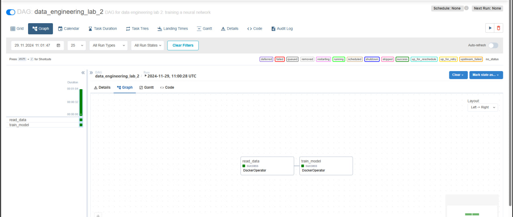

# Кришталь Кирилл Евгеньевич Группа 6231-010402D
# Лабораторная работа №2: Инференс и обучение нейронных сетей  

## Часть 1: Автоматическое распознавание речи  

### Реализация компонента DAG для мониторинга директории  

В рамках первого шага реализован компонент DAG, который проверяет директорию на наличие новых видеофайлов.  
Для этого создано новое подключение `fs_conn_id`.  

**Подключение:**  
  

### Извлечение аудио из видео  

На втором этапе используется готовый образ из Docker Hub, который автоматически извлекает аудиодорожку из видеофайлов.  

### Реализация скриптов:  
Для выполнения следующих этапов были разработаны скрипты:  
1. **Распознавание речи:**  
   - Используется API **Hugging Face** для преобразования аудио в текст.  

2. **Формирование конспекта:**  
   - Обработка текста для создания краткого и информативного содержания.  

3. **Генерация PDF:**  
   - Для экспорта конспекта в формат PDF применена библиотека `fpdf`.  

Все три скрипта собраны в Docker-образ `ml_model_image` и загружены в Docker Hub.  
- **Код скриптов:** доступен в папке `scripts`.  
- **Dockerfile для образа:** находится в `docker/Dockerfile.extract_audio`.  

### Запуск DAG в Airflow  

На финальном этапе разработанный DAG запускается в Airflow:  
- Мониторинг файлов.  
- Извлечение аудио.  
- Преобразование речи в текст.  
- Формирование и экспорт PDF.  

**Пример работы DAG:**  
  

Результаты выполнения пайплайна сохраняются в папке `data`.  

---

## Часть 2: Обучение нейросети  

В этой части необходимо построить пайплайн, который реализует автоматическое обучение или дообучение нейронной сети.  

### Этапы пайплайна:  
1. **Чтение данных:**  
   - Загрузка набора данных из указанного источника (файловой системы, сетевого интерфейса и т.д.).  

2. **Подготовка данных:**  
   - Формирование пакетов данных для обучения модели.  

3. **Обучение модели:**  
   - Выбор и обучение модели на основе заданных данных.  

4. **Сохранение результатов:**  
   - Сохранение логов, значений функции ошибки и других метрик в текстовые файлы для анализа.  

## Реализация второго DAG  

### Описание  
Для реализации второго DAG также используется предложенный шаблон. Цель данного пайплайна — автоматизировать процесс чтения, подготовки данных и обучения нейронной сети.  

### Подготовка структуры проекта  
Созданы три основные папки для хранения данных:  
- **`raw`** — исходные данные для чтения.  
- **`prepared`** — данные, подготовленные для обучения модели.  
- **`trained`** — обученная модель и её метрики, сохранённые в текстовом файле.  

### Разработка скриптов  
Написаны следующие скрипты, которые автоматизируют обработку данных и обучение модели:  
1. **Скрипт для чтения и обработки данных:**  
   - Выполняет загрузку данных из папки `raw` и преобразует их для дальнейшего обучения.  
   - Результат сохраняется в папку `prepared`.  

2. **Скрипт для обучения модели:**  
   - На основе данных из папки `prepared` запускается процесс обучения.  
   - Обученная модель и метрики сохраняются в папке `trained`.  

Все скрипты можно найти в папке `scripts`.  

### Сборка Docker-образов  
Для выполнения этапов пайплайна разработаны два Docker-образа:  
- Образ для обработки данных.  
- Образ для обучения модели.  

Оба образа собраны и загружены в Docker Hub.  
- **Dockerfile-ы:** доступны в папке `docker`.  

### Запуск DAG в Airflow  
Разработанный DAG запускается в Airflow.  
Он поэтапно выполняет:  
1. Чтение и обработку данных из папки `raw`.  
2. Сохранение обработанных данных в папку `prepared`.  
3. Обучение модели на подготовленных данных.  
4. Сохранение модели и метрик в папке `trained`.  

**Пример работы DAG2:**  
  

### Результаты  
Пайплайн успешно завершён. Результаты:  
- Подготовленные данные находятся в папке `prepared`.  
- Обученная модель и её метрики — в папке `trained`.  

